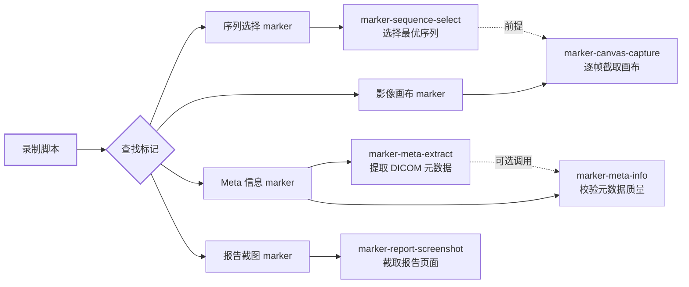
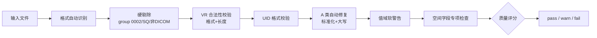

# Skills — Playwright Codegen 智能标记工具 技能套件

> 本目录包含一组处理 Playwright 录制脚本中「标记」（Marker）的自动化技能套件。
> 每个技能对应一种标记类型，负责将占位注释替换为可执行的自动化代码。

---

## 技能总览

| 技能 | 触发标记 | 作用 | 前置依赖 |
|------|---------|------|---------|
| [`marker-sequence-select`](skills/marker-sequence-select/SKILL.md) | `# [MARKER: 序列选择]` | 自动从 DICOM viewer 序列列表中选择最优序列 | 无 |
| [`marker-canvas-capture`](skills/marker-canvas-capture/SKILL.md) | `# [MARKER: 影像画布交互]` | 在 DICOM canvas 上逐帧翻页并截图 | **需先执行 `marker-sequence-select`** |
| [`marker-meta-extract`](skills/marker-meta-extract/SKILL.md) | `# [MARKER: Meta 信息工具 @ {ts}]` | 从 DICOM viewer 信息面板提取元数据 | [`viewers.yaml`](skills/_shared/viewers.yaml) |
| [`marker-meta-info`](skills/marker-meta-info/SKILL.md) | 无（独立工具） | 对已提取的 DICOM 元数据进行质量校验 | Python 3.11+ |
| [`marker-report-screenshot`](skills/marker-report-screenshot/SKILL.md) | `# [MARKER: 报告截图 @ {ts}]` | 在报告页插入稳定等待和截图代码 | 无 |

---

## 技能间的关系



- **`marker-sequence-select`** 是 `marker-canvas-capture` 的前置条件 — 必须先选择好序列，画布上才有影像可截取。
- **`marker-meta-extract`** 可选的调用 `marker-meta-info` 对提取结果做质量校验。
- **`marker-meta-info`** 是唯一的纯离线工具（不依赖 Playwright），可以直接对已有的元数据文件运行校验。

---

## 共享基础设施

### `viewers.yaml`（[项目根目录](skills/_shared/viewers.yaml)）

所有依赖 DOM 交互的技能共享一份 viewer 注册表，通过 URL pattern 匹配为不同 DICOM viewer 提供适配配置：

```yaml
viewers:
  uicloud:
    url_patterns: ["uicloud.com"]
    iframe_selectors: ['[id="2d-iframe"]']
    meta_panel:
      open_button_names: ["DICOM信息 F2", "DICOM信息"]
      tag_row_format: "table_tr_td"
      ...
  cxhospital:
    url_patterns: ["cxss.zjcxph.com"]
    ...
```

**匹配原则**：录制脚本中的 `page.goto("...")` URL → 匹配 `url_patterns` → 使用对应 viewer 配置。未命中则使用 `generic` 兜底，从录制脚本已有的 `locator()` 反推选择器。

**新增 viewer**：复制 `generic` 模板，填入 URL pattern + iframe 选择器 + 按钮名称 + tag 行解析格式，在真实 viewer 上实测即可。

---

## 各技能详解

### 1. `marker-sequence-select` — 序列选择

**触发标记**：`# [MARKER: 序列选择]`

在 DICOM viewer 的序列列表中自动选择最优序列。三层降级策略：

| 策略 | 方法 | 适用场景 |
|------|------|---------|
| **A**（首选） | JS DOM 遍历所有可见元素 → 多模式提取帧数（中文"幅/张"/英文"images/frames"/裸数字）→ 按帧数+关键词+位置评分 → 坐标双击 | 标准 viewer 列表 |
| **B**（降级） | `body.inner_text()` 文本块解析 → `get_by_text` 点击 | DOM 层级复杂 |
| **C**（兜底） | 截图 → VL 模型返回坐标 → 坐标点击 | DOM 完全不可用 |

**排序依据**：详见 [`references/priority_keywords.md`](skills/marker-sequence-select/references/priority_keywords.md)。关键词分档（100: Thin/MPR/Coronal, 80: VR/3D/MIP, -1: Scout/Localizer 跳过）、帧数加成（每 10 帧 +1，上限 +50）、厚层惩罚（<50 帧且无 MPR/VR/MIP 标签则跳过）。

**不依赖 `viewers.yaml`**：自包含、跨 viewer 通用。

---

### 2. `marker-canvas-capture` — 影像画布交互

**触发标记**：`# [MARKER: 影像画布交互]`

定位 DICOM viewer 的 `<canvas>`，逐帧翻页并截取为 JPEG 文件。

**四组翻页策略**（按优先级）：

| 策略 | 方法 | 通用性 |
|------|------|--------|
| JS API 翻页 | `instanceStack[0].viewport.scroll()` | 限 cornerstoned3D |
| 键盘箭头 | `page.keyboard.press("ArrowDown")` | **最通用** |
| 鼠标滚轮 | `canvas.hover()` + `mouse.wheel()` | 次选 |
| 滑块按钮 | `locator("按钮选择器").click()` | 特定 viewer |

**渲染等待**：轮询 `canvas.toDataURL()` 输出长度变化（避免固定 timeout），适应不同 viewer 的渲染速度差异。

**去重**：按文件大小排除重复帧，输出到 `canvas_frames/` 目录。

**依赖**：[`references/rendering_wait.md`](skills/marker-canvas-capture/references/rendering_wait.md) 解释了 timeout 策略和 viewer 陷阱；[`references/navigation_debug.md`](skills/marker-canvas-capture/references/navigation_debug.md) 提供了调试清单。

---

### 3. `marker-meta-extract` — Meta 信息提取

**触发标记**：`# [MARKER: Meta 信息工具 @ {ts}]`

从 DICOM viewer 的信息面板中自动提取元数据，输出结构化 JSON。

**提取流水线**：

```
定位 viewer → 匹配 viewers.yaml → 定位 iframe
  → 打开信息面板（依次尝试按钮名称）
  → DOM 提取 tag 行（table_tr_td / flex_div / tree_node）
  → 少于 10 行则回退到 VL 截图识别
  → 调用 marker-meta-info 校验
  → 输出 dicom_meta_{ts}.json
```

**三种 DOM 提取策略**（通过 `viewer.meta_panel.tag_row_format` 选择）：

| 格式 | 说明 | 典型 viewer |
|------|------|-------------|
| `table_tr_td` | `<table><tr><td>tag</td><td>desc</td><td>value</td>` | uicloud |
| `flex_div` | Flex 布局 row 容器，内含 tag/desc/value | 部分国产 viewer |
| `tree_node` | 树形结构，递归提取叶子节点 | 复杂 viewer |

**部署方式**：`scripts/extract_dicom_meta.py` 可从命令行调用，自动解析录制脚本、定位 marker、生成替换代码。

**依赖**：`viewers.yaml`（必需）、`marker-meta-info`（可选校验）。

---

### 4. `marker-meta-info` — Meta 信息质量校验

**不依赖标记**：独立离线工具，对已提取的 DICOM 元数据做质量校验。

**自动识别 5 种输入格式**：

| 格式 | 来源 |
|------|------|
| VL 输出 | `marker-meta-extract` 的 VL 截图回退结果 |
| DOM 表格 | `marker-meta-extract` 的 DOM 提取结果 |
| canonical JSON | 标准 DicomMeta 格式 |
| key_values | 键值对字典 |
| text_dump | `dcmdump` 或 PDF 转储文本 |

**校验流水线**：



**5 个输出产物**：

| 文件 | 内容 |
|------|------|
| `validated_metadata_table.json` | 校验后的结构化表格 |
| `rejected_rows.json` | 被硬剔除的行 |
| `metadata_warnings.json` | 所有警告 |
| `spatial_issues.json` | 空间字段专项问题 |
| `validation_summary.json` | 质量评分汇总 |

**无 Playwright 依赖**：`pip install` + Python 3.11 即可离线运行。

---

### 5. `marker-report-screenshot` — 报告截图

**触发标记**：`# [MARKER: 报告截图 @ {ts}]`

最简单的技能，专注于正确插入截图前的稳定等待逻辑。

**处理规则**：

1. **定位 marker** → 按时间戳搜索
2. **检查作用域** → 若在 `def run()` 外部则移入
3. **判断截图对象** → 根据前面操作确定 `page` 或 `page1`
4. **插入等待逻辑** → `wait_for_load_state("networkidle", timeout=10000)` + timeout 兜底（避免 DICOM viewer 长连接挂死）+ `wait_for_timeout(2000)` 等待 canvas 渲染
5. **生成截图代码** → `page.screenshot(path='report_{ts}.png', full_page=True)`

**无配置文件依赖**，直接提供可粘贴的代码块。

---

## 完整工作流示例

```
原始录制脚本中：
  page.get_by_role("button").click()
  # [MARKER: 序列选择]
  page.locator("canvas").first.click()
  # [MARKER: 影像画布交互]
  # [MARKER: Meta 信息工具 @ 20260625_120000]
  page.get_by_text("确认").click()
  # [MARKER: 报告截图 @ 20260625_120000]

处理步骤：
  1. marker-sequence-select → 插入序列选择代码
  2. marker-canvas-capture  → 插入 canvas 逐帧截图代码
  3. marker-meta-extract    → 插入 Meta 信息提取代码
  4. marker-report-screenshot → 插入报告截图代码

处理后脚本可直接运行，完成自动化回归。
```

---

## 调试原则

生成 complete.py 过程中，如果发现代码不合理，**必须遵循以下原则**：

> **先更新完善 skill，再重新生成 complete 代码。不得直接手改 complete.py。**

### 原因

- Skill 是所有医院的共享知识库。直接改 complete.py 只修了一个医院的问题，同类型的 skill 缺陷在其他医院会再次出现。
- Skill 更新后，重新运行 `agent.py` 即可为所有受影响医院一次性生成正确的代码。

### 调试流程

```
发现 complete.py 代码不合理（选择器不对/等待不当/交互错误）
  └→ 定位对应的 skill 目录（如 marker-sequence-select）
     └→ 分析根因：是 viewer 差异还是 skill 逻辑不完善？
        └→ 更新 skill 内容：
           ├── SKILL.md      — 修改逻辑/规则
           ├── references/   — 补充技术方案/调试经验
           └── test_data/    — 增加测试用例
        └→ 重新运行 agent.py 生成 complete.py
           └→ 验证修复效果
              ├── 通过 → 完成
              └── 仍不合理 → 回到分析步骤，继续完善 skill
```

### Skill 完善清单

更新 skill 时检查以下维度：

| 维度 | 检查项 |
|------|--------|
| **选择器** | viewer 的 DOM 结构是否不同？iframe/class/id 是否需要适配？ |
| **等待策略** | 页面加载/渲染/网络请求的等待方式是否恰当？固定 timeout 是否过多？ |
| **交互流程** | 按钮名称/点击顺序/翻页方式是否适配该 viewer？ |
| **回退策略** | 主策略失败时是否有合理的降级（DOM → 文本块 → VL 截图）？ |
| **错误处理** | try/except 是否覆盖关键路径？失败日志是否足够定位问题？ |

**Q: 技能之间如何共享 viewer 配置？**
A: 所有依赖 DOM 交互的技能统一读取项目根目录的 [`viewers.yaml`](skills/_shared/viewers.yaml)，通过 URL pattern 匹配 viewer。新增 viewer 只需在该文件中添加配置项。

**Q: 为什么有的技能有 `scripts/` 目录，有的没有？**
A: `marker-meta-extract` 和 `marker-meta-info` 实现了完整的命令行工具，有独立脚本；`marker-sequence-select` 和 `marker-canvas-capture` 提供的是可粘贴代码块；`marker-report-screenshot` 是纯规则替换指南。

**Q: 生成 complete.py 时发现代码不合理怎么办？**
A: 遵循「先改 skill，再重新生成」的原则。不要直接手改 complete.py。详见本章「调试原则」部分。

**Q: 哪里可以看到所有技能的完整文档？**
A: 每个技能目录下的 `SKILL.md` 是入口文档，`references/` 目录存放详细的技术参考资料。
